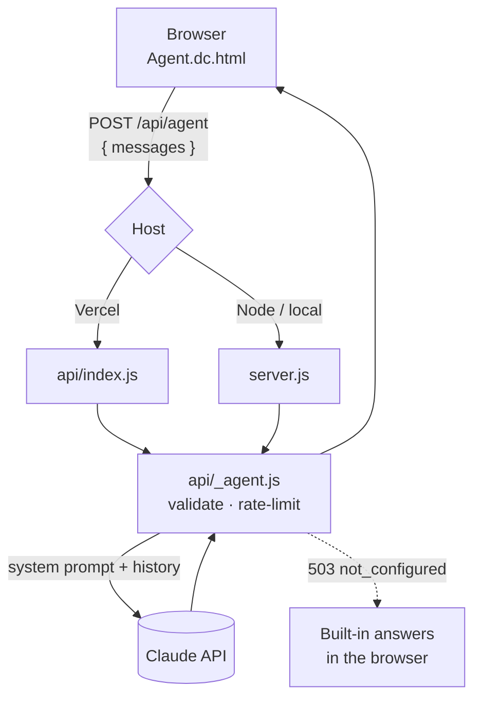

<div align="center">

# Jawad Ul Hadi · Portfolio

**Backend Lead / Architect building multi-tenant SaaS and AI-first systems that fail predictably.**

Static portfolio pages plus one serverless endpoint that powers **"Ask Jawad"**, a Claude-backed portfolio agent you can chat with by text or voice.

[](LICENSE)
[](.nvmrc)
[](https://vercel.com)
[](https://docs.anthropic.com)
[](https://github.com/JawadulHadi/juh_Bukhari_Portfolio/actions/workflows/ci.yml)

[Live site](https://juh-bukhari.vercel.app) · [Wiki](docs/wiki/Home.md) · [Changelog](CHANGELOG.md) · [Contact](https://gravatar.com/juhbukhari)

</div>

---

## Contents

- [Features](#features)
- [Tech stack](#tech-stack)
- [Quick start](#quick-start)
- [Configuration](#configuration)
- [Project structure](#project-structure)
- [How it works](#how-it-works)
- [Deployment](#deployment)
- [Contact policy](#contact-policy)
- [Documentation](#documentation)
- [Contributing](#contributing)
- [License](#license)

## Features

- **Portfolio page**: experience first, then selected work (the projects named on the résumé), stack & credentials, public repositories and the Qeloma suite, a case-study teaser, and services & contact. Includes Open Graph and Twitter card tags for link previews.
- **Credentials page** (`/credentials`): every certification with topic filters and issuer verification links. The main page shows only the ones on the résumé.
- **Case study: *Designing for AI Failure***: the Retry → RAG Fallback → Rule-Based Floor pattern, with architecture figures and an interactive failure simulator.
- **"Ask Jawad" agent**: a floating chat on every page, backed by Claude on the server. It supports voice input and read-aloud, can navigate the site ("take me to projects"), and falls back to built-in answers when the API isn't configured.
- **Three themes**: Horizon (dark, ember glow), Paper (light, classical) and Mono. The choice is saved in `localStorage` and synced across tabs.
- **Accessibility**: honours `prefers-reduced-motion`, uses ARIA-labelled controls and semantic sections.
- **Hardened by default**: the API key never reaches the browser, input is validated, requests are rate-limited, and security headers are set.

## Tech stack

| Layer             | Technology                                                                                 |
| ----------------- | ------------------------------------------------------------------------------------------ |
| Pages             | `.dc.html` templates rendered by the generated dc-runtime (`support.js`, React 18 UMD) |
| Styling           | Classical design system tokens (`_ds/`) + theme overrides (`theme.js`)                 |
| Agent backend     | Node.js ≥ 20,[`@anthropic-ai/sdk`](https://www.npmjs.com/package/@anthropic-ai/sdk)      |
| Local / Node host | Express 4 (`server.js`)                                                                  |
| Serverless        | Vercel function (`api/index.js`)                                                         |
| Voice             | Web Speech API (`SpeechRecognition` + `speechSynthesis`)                               |

## Quick start

```bash
git clone https://github.com/JawadulHadi/juh_Bukhari_Portfolio.git
cd juh_Bukhari_Portfolio
npm install
cp .env.example .env        # optional: add ANTHROPIC_API_KEY for the live agent
npm run dev
```

Open [http://localhost:3000](http://localhost:3000). Without an API key, everything works and the agent answers from its built-in responses.

> `server.js` doesn't load `.env` automatically. Export the variable in your shell (`export ANTHROPIC_API_KEY=...`, or `$env:ANTHROPIC_API_KEY="..."` in PowerShell) or run `node --env-file=.env server.js`.

## Configuration

| Variable                 | Required           | Default  | Purpose                               |
| ------------------------ | ------------------ | -------- | ------------------------------------- |
| `ANTHROPIC_API_KEY`    | For the live agent | none     | Claude API key, used server-side only |
| `ANTHROPIC_AUTH_TOKEN` | No                 | none     | Alternative bearer-token auth         |
| `PORT`                 | No                 | `3000` | Express port (ignored on Vercel)      |

Agent tuning lives in [`api/_agent.js`](api/_agent.js):

| Constant                                    | Value             | Meaning                                          |
| ------------------------------------------- | ----------------- | ------------------------------------------------ |
| `MODEL`                                   | `claude-opus-5` | Claude model used for replies                    |
| `MAX_TURNS`                               | `20`            | Max messages per request                         |
| `MAX_CHARS`                               | `2000`          | Per-message character cap (content is truncated) |
| `MAX_REQUESTS_PER_WINDOW` / `WINDOW_MS` | `30` / 10 min   | Per-IP rate limit (per instance)                 |

## Project structure

```text
.
├── index.html              # Main page, served at /
├── case-study.html         # "Designing for AI Failure" + failure simulator, served at /case-study
├── credentials.html        # Full, filterable certification list, served at /credentials
├── certs.js                # Certification data, shared by index.html and credentials.html
├── Agent.dc.html           # Floating "Ask Jawad" agent, imported by both pages
├── theme.js                # Horizon / Paper / Mono themes, scroll reveals, cursor effects
├── support.js              # GENERATED dc-runtime, do not edit
├── _ds/                    # GENERATED Classical design-system tokens + bundle
├── api/
│   ├── _agent.js           # Shared Claude handler (validation, rate limit, prompt)
│   ├── agent.js            # Vercel serverless entry → /api/agent (GET = health check, POST = chat)
│   └── index.js            # Re-exports agent.js for the legacy /api/* rewrite
├── server.js               # Express server for local dev / any Node host
├── assets/portrait.jpg
├── assets/og-1200x630.png  # Open Graph / Twitter card image
├── JUH-LOGO.svg
├── resume.pdf
├── vercel.json             # Rewrites + security headers
└── docs/wiki/              # Project wiki (GitHub-wiki compatible)
```

## How it works



1. The agent posts the chat history to `POST /api/agent`.
2. `api/_agent.js` checks that a key is configured, applies the per-IP rate limit, and validates the history.
3. It calls Claude with a cached system prompt that states Jawad's facts and the house rules.
4. The reply comes back as plain text, suitable for read-aloud. On any failure, the browser falls back to built-in answers.

**Checking a deployment.** Open `/api/agent` in a browser. `{"ok":true,"configured":true,...}` means the key is set; `configured:false` means `ANTHROPIC_API_KEY` is missing from that environment. The chat also shows *why* it fell back to offline answers in its status line.

**Failure ladder.** Each question tries the primary model with server-side refusal fallback, then the primary model plain, then a backup model (`AGENT_MODEL` and `AGENT_BACKUP_MODEL` override the defaults). Auth and rate-limit errors are not retried.

See [Architecture](docs/wiki/Architecture.md) and [API Reference](docs/wiki/API-Reference.md) for details.

## Deployment

**Vercel (recommended).** Import the repo, set `ANTHROPIC_API_KEY` under *Project Settings → Environment Variables*, and deploy. `vercel.json` routes `/api/*` to the function and sets the security headers.

**Any Node host (Render, Railway, Fly, VPS).** Build with `npm ci`, start with `npm start`, and set `ANTHROPIC_API_KEY` (plus `PORT` if the host needs it).

Full guide: [Deployment](docs/wiki/Deployment.md).

## Contact policy

The **only** public contact channel is **[gravatar.com/juhbukhari](https://gravatar.com/juhbukhari)**. The pages, the agent's fallback answers and the server prompt all point there. The agent is instructed never to share an email address or phone number. Keep it that way when you edit content.

## Documentation

| Page | What's inside |
| -------------------------------------------------------------------- | -------------------------------------------- |
| [Wiki home](docs/wiki/Home.md) | Start here |
| [Architecture](docs/wiki/Architecture.md) | Components, request flow, design decisions |
| [Local Development](docs/wiki/Local-Development.md) | Setup, scripts, testing the agent |
| [Deployment](docs/wiki/Deployment.md) | Vercel and Node hosts, headers, redirects |
| [Portfolio Agent](docs/wiki/Portfolio-Agent.md) | Prompt, fallbacks, voice, navigation |
| [API Reference](docs/wiki/API-Reference.md) | `POST /api/agent` contract and error codes |
| [Theming &amp; Design System](docs/wiki/Theming-and-Design-System.md) | Themes, tokens,`JUHTheme` API |
| [Content Guide](docs/wiki/Content-Guide.md) | How to update work, projects and credentials |
| [Troubleshooting](docs/wiki/Troubleshooting.md) | Common problems and fixes |

## Contributing

Issues and PRs are welcome. Read [CONTRIBUTING.md](CONTRIBUTING.md) and the [Code of Conduct](CODE_OF_CONDUCT.md) first. Report security issues privately as described in [SECURITY.md](SECURITY.md).

## License

The code is released under the [MIT License](LICENSE). Personal content (portrait, résumé, bio, case study text) is **not** covered. See [NOTICE.md](NOTICE.md).

<div align="center">
