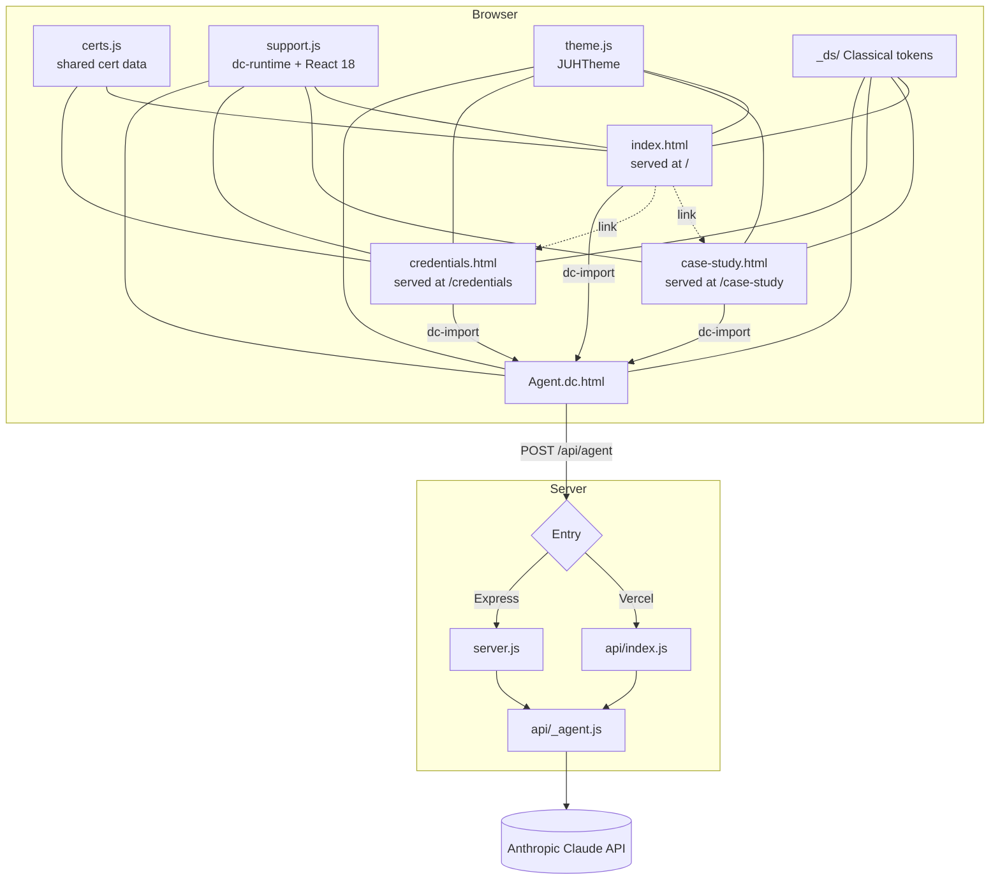
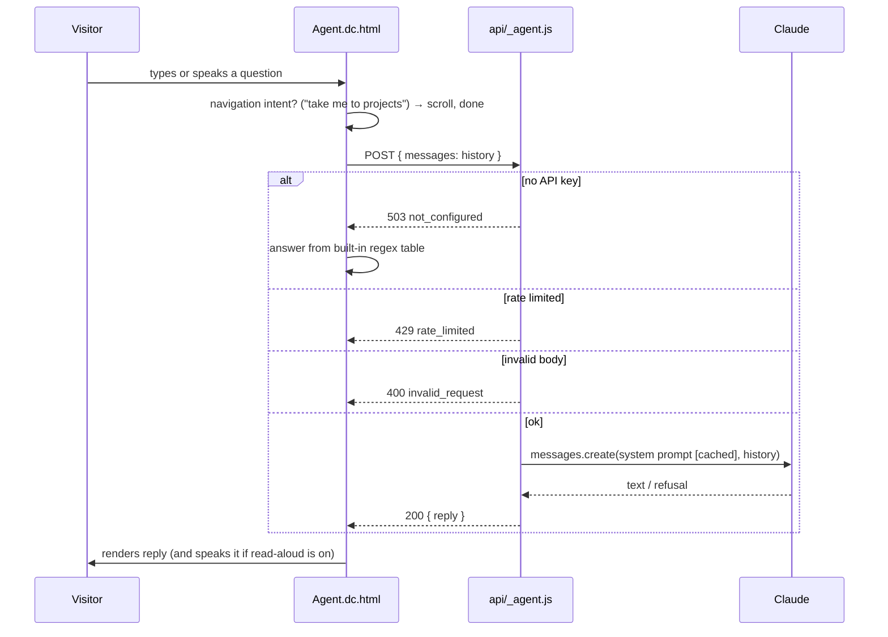

# Architecture

## Components

| Component | Responsibility |
| --- | --- |
| `index.html`, `case-study.html`, `credentials.html` | The three pages, served at `/`, `/case-study` and `/credentials` via `cleanUrls`. Old `/Portfolio.dc*` and `/Case Study.dc*` URLs 301-redirect to them |
| `certs.js` | Certification data (`window.JUH_CERTS`) shared by `index.html` (résumé highlights) and `credentials.html` (full list) |
| `*.dc.html` | Page templates inside `<x-dc>`. `<helmet>` injects head tags, `<sc-if>` handles conditionals, `<dc-import>` embeds another dc page |
| `support.js` | **Generated** dc-runtime. Parses `<x-dc>` and renders it with React 18 (UMD from unpkg) |
| `_ds/classical-…/` | **Generated** Classical design system: CSS custom properties (colour ramps, spacing, fonts) and a namespace bundle |
| `theme.js` | Theme switching (overrides CSS variables), scroll-reveal via `IntersectionObserver`, cursor effects |
| `api/_agent.js` | The only backend logic: config check → rate limit → validation → Claude call → reply shaping |
| `api/index.js` | Vercel function adapter. `vercel.json` rewrites `/api/*` here |
| `server.js` | Express adapter for local dev and non-Vercel hosts. Also serves the static files |

## Request lifecycle: `POST /api/agent`

## Design decisions

| Decision | Why |
| --- | --- |
| **One shared handler, two thin adapters** | The same `handleAgentRequest(body, ip)` returns `{ status, body }`, so Express and Vercel stay in lockstep with no duplicated logic |
| **`_agent.js` underscore prefix** | Vercel treats files in `api/` as functions. The underscore marks this one as a private module |
| **Key stays on the server** | The browser only ever talks to `/api/agent`, so the Anthropic key can't leak via DevTools |
| **Graceful degradation** | With no key, a network error or any non-200 response, the agent answers from a built-in table. The site never shows a broken chat |
| **Prompt caching** | The system prompt is sent with `cache_control: ephemeral`, which cuts cost and latency on repeat turns |
| **Low effort, short replies** | `output_config.effort: 'low'` and `max_tokens: 1024`. Chat answers are meant to be short and speakable |
| **Plain-text replies** | The prompt forbids markdown so replies read well aloud and need no HTML rendering, which removes an XSS vector |
| **Server-side fallback beta** | `server-side-fallback-2026-07-01` with `fallbacks: 'default'` lets the API re-run a declined turn on a suitable fallback model |
| **In-memory rate limit** | Simple and dependency-free. The trade-off is that the limit is per instance (see [Security](../../SECURITY.md)) |

## Known limitations

- The rate-limit `Map` is never pruned of idle IPs. That's fine for serverless (instances recycle) but grows slowly on a long-lived Express process.
- Rejected requests still count toward the rate-limit window.
- Voice input depends on the Web Speech API, which Chrome, Edge and Safari support and Firefox doesn't.
